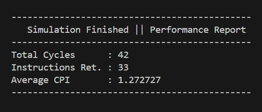

# 🚀 5-Stage Pipelined RISC-V Processor

## 📌 Project Overview
This repository contains the RTL design and simulation of a 5-stage pipelined 32-bit **RISC-V** processor.  
The processor implements a subset of the **RV32I** instruction set and follows the classic pipeline architecture:

> **IF → ID → EX → MEM → WB**

The processor handles **data and control hazards** effectively using dedicated **Forwarding** and **Hazard** units, ensuring correct execution and efficient performance.

---

## ⚙️ Key Features

### 🧩 Pipeline Architecture
- **5-Stage Pipelined Datapath:** IF, ID, EX, MEM, WB
- **Base ISA:** Partially implements the **RV32I** instruction set
 
### 🧮 Supported Instruction Types
- ✅ **R-Type** (includes ADD, SUB, AND, OR, SLT)
- ✅ **I-Type** (includes LW, ADDI, ANDI, ORI, SLTI)
- ✅ **S-Type** (includes SW)
- ✅ **B-Type** (includes BEQ)
- ✅ **J-Type** (includes JAL)

### 🔁 Hazard Handling
- **Forwarding Unit:**  
Resolves **Read-After-Write (RAW)** data hazards from **MEM** and **WB** stages.
- **Hazard Unit:**  
Handles **load-use stalls** (1-cycle bubble) and **branch flushes** (via NOP insertion).

### ⚡ Performance
- Achieves an **average CPI ≈ 1.2727** on the comprehensive test suite.
- Demonstrates **high throughput and efficiency** compared to the single-cycle version.

---

## 🧠 RV32I 5-Stage Pipelined Processor Architecture

## 📊 Instruction Type Distribution

The benchmark program executed a total of **33 instructions**, categorized as follows:

| **Instruction Type** | **Count** | **Percentage** |
|-----------------------|:---------:|:--------------:|
| **R-type**            | 21        | 63.64%         |
| **Load**              | 2         | 6.06%          |
| **Jump**              | 1         | 3.03%          |
| **I-type**            | 6         | 18.18%         |
| **Branch**            | 1         | 3.03%          |
| **Store**             | 2         | 6.06%          |
| **Total**             | **33**    | **100%**       |

---

## ⚙️ Performance Report

| **Metric**                      | **Value**    |
|---------------------------------|:-------------:|
| **Total Cycles**                | 42            |
| **Total Instructions Executed** | 33            |
| **Average CPI**                 | 1.2727        |

- 37 cycles as for theory for 33 instructions, the formula is (n-1+k) where k are the stages and n is the total no. of instructions.
- So for n = 33 , it should be total of 37 cycles but for 1 branch, 1 jump success and 1 dependent load. There will be 5 penalties.

| Core | Cycles | Instructions | CPI |
|---:|---:|---:|---:|
| Single-Cycle RV32I | 33 | 33 | 1.00 |
| Pipelined RV32I | 42 | 33 | 1.27 |

- Note: pipeline fill/drain and stalls cause CPI > 1; the pipelined design still wins in time because of shorter clock period per stage.
- Also we haven't considered NOP Instructions due to branch and jump success as they are not useful Instructions.
---

---

✅ The pipeline achieved efficient performance with an **average CPI of 1.27**, demonstrating effective hazard handling and instruction throughput.

---

## ⚠️ Hazard Handling and Penalties

### 🔹 Data Hazards
- **RAW (with forwarding):** 0 cycles (no stall)  
- **Load–use hazard:** +1 cycle penalty (stall inserted)

### 🔹 Control Hazards
- **BEQ taken (resolved in EX):** +2 cycles penalty  
  - Wrong-path instructions in **ID** and **IF** must be flushed  
- **BEQ not taken:** 0 cycles   
- **JAL (if resolved in EX):** +2 cycles penalty
  - Wrong-path instructions in **ID** and **IF** must be flushed 

### 🔹 Structural Hazards
- **None** (Harvard architecture: separate instruction/data memories) → 0 cycles

---

## 📊 Hazard Penalty Summary

| Hazard Type           | Where Resolved | Penalty (Cycles) |
|-----------------------|----------------|------------------|
| RAW (with forwarding) | EX             | 0                |
| Load–use (forwarding) | MEM→WB timing  | +1               |
| BEQ taken             | EX             | +2               |
| BEQ not taken         | —              | 0                |
| JAL (EX target)       | EX             | +2               |
| Structural (Harvard)  | —              | 0                |

---

## 🛠️ Technologies Used
- ✅ Verilog HDL  
- ✅ Icarus Verilog (simulation)  
- ✅ GTKWave (waveform visualization)  
- ✅ VS Code (development)  

---

## 🔗 References
- Patterson, D. A., & Hennessy, J. L. (2017). *Computer Organization and Design RISC-V Edition: The Hardware Software Interface*. Morgan Kaufmann.  
- [RISC-V ISA Manual (Volume I: User-Level ISA)](https://riscv.org/technical/specifications/)  
- [RISC-V Wikipedia](https://en.wikipedia.org/wiki/RISC-V)  

