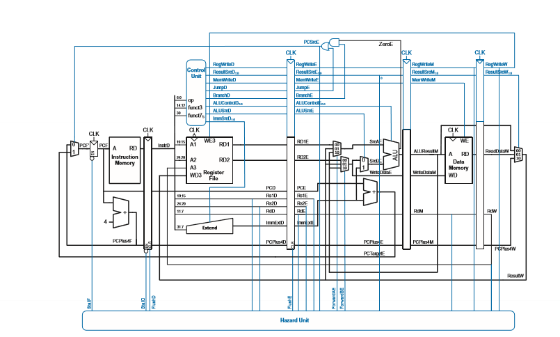

# 🚀 RV32I Verification Flow

## 📌 Project Overview
This repository contains the RTL design and simulation environment for a 5-stage pipelined 32-bit **RISC-V** processor.

The processor implements a subset of the **RV32I** instruction set and follows the classic pipeline architecture:

> **IF → ID → EX → MEM → WB** 

The core focuses on efficient execution by handling **data and control hazards** using dedicated **Forwarding** and **Hazard** units.

---

## ⚙️ Key Features

### 🧮 Supported Instruction Types
- ✅ **R-Type** (includes ADD, SUB, AND, OR, SLT)
- ✅ **I-Type** (includes LW, ADDI, ANDI, ORI, SLTI)
- ✅ **S-Type** (includes SW)
- ✅ **B-Type** (includes BEQ)
- ✅ **J-Type** (includes JAL)

### 🔁 Hazard Handling
- **Forwarding Unit:**
    Resolves **Read-After-Write (RAW)** data hazards from **MEM** and **WB** stages. 
- **Hazard Unit:**
    Handles **load-use stalls** (1-cycle bubble) and **branch flushes** (2-cycles via NOP).

### ⚡ Performance
- Achieves an **average CPI $\approx 1.3378$** on the comprehensive test suite.
- Demonstrates **high throughput and efficiency** compared to the single-cycle version.

---

## 🧠 Processor Architecture

---

# 💻 Development and Simulation Flow (Automated Scripts)

The entire verification process is managed by a modular Python flow control script (`run_sim.py`), which automates assembly-to-hex conversion, compilation, simulation, regression execution, and log management.

---

## 1. `generate_hex.py` (Instruction Converter)

This script is responsible for preparing the instruction memory contents for simulation.

- **Function:** Converts human-readable RISC-V assembly programs (`.asm`) into machine-readable hex format.
- **Output:** Generates **`risc_memfile.hex`**, which is loaded into the Instruction Memory module (`risc.v`) during simulation initialization.

---

## 2. `run_sim.py` (Verification Flow Manager)

This is the main entry point for running the verification flow. It orchestrates the complete process using **Icarus Verilog (`iverilog` / `vvp`)** and **GTKWave**.

### Key Responsibilities
- RTL compilation using `iverilog`
- Simulation execution using `vvp`
- Automated GTKWave launch for waveform analysis
- **Multi-program regression support**
- **Per-test log file generation for clean debugging**

### 📄 Simulation Logs
- Each test program produces a **separate log file** (e.g., `program1.log`, `program2.log`)
- Logs capture simulation messages, performance statistics, and final execution status
- Enables easy comparison and debugging across regression runs

---

## ⚙️ Main Commands

### ▶️ Single Test Execution

Runs the full flow for a single program:
- Hex generation
- Compilation
- Simulation
- GTKWave launch

| Command | Description |
|------|------------|
| `python run_sim.py` | Runs the complete verification flow |

---

## 🔁 Regression Mode

Regression mode executes **all `program*.asm` files** present in the directory using a single compiled RTL.

| Command | Description |
|------|------------|
| `python run_sim.py --regress` | Runs multi-program regression with per-test logs |

At the end of regression, a summary is printed showing:
- Total tests
- Passed tests
- Failed tests

> **Note:** PASS indicates successful simulation completion and correct end-to-end flow execution.

---

## 🔬 Simulation Control Commands

Optional flags allow skipping specific steps for faster iteration and debugging.

| Command | Effect | Use Case |
|------|------|--------|
| `python run_sim.py --no-sim` | Skips VVP simulation and GTKWave | Quick **compile-only** check |
| `python run_sim.py --no-gui` | Skips GTKWave launch | Log-based verification without waveform viewing |

---

## 🧹 Cleaning Command

Removes all generated artifacts to reset the workspace.

| Command | Files Removed |
|------|--------------|
| `python run_sim.py --clean` | `riscv_sim_executable`, `risc.vcd`, `risc_memfile.hex`, `*.log` |

---

# 📊 RISC-V Custom Performance Testbench

This report summarizes the performance of our **RISC-V ASM benchmark program** executed on the pipelined RTL design.

---

## 📝 Instruction Distribution

The benchmark program (program3) executed a total of **74 instructions**, categorized as follows:

| **Instruction Type** | **Count** | **Percentage** |
| :--- | :--- | :--- |
| **R-type** (add) | 11 | 14.85% |
| **I-type** (addi) | 40 | 54.05% |
| **Load** (lw) | 1 | 1.35% |
| **Store** (sw) | 3 | 4.05% |
| **Branch** (beq) | 19 | 25.65% |
| **Total** | **74** | **100%** |

> **Note:** Counts reflect **instructions actually retired** in the RTL design. Branch flushes and load-use stalls affect the totals.

---

## ⚡ Summary Table

| Core / Design | Cycles | Instructions Retired | CPI |
|---------------|--------|--------------------|-----|
| Ideal Single-Cycle | 74 | 74 | 1.00 |
| **Pipelined RV32I (with stalls)** | **99** | **74** | **1.3378** |

**Observations:**

- The pipelined CPI > 1 due to **load-use and branch stalls**.  
- Skipped dummy instructions and branch flushes explain why not all instructions in the HEX are counted as retired.  
- Despite higher CPI, the pipelined design is faster in **real time**, as each pipeline stage has a shorter clock period than a single-cycle core.

---

## 🛠️ Technologies Used
- ✅ Verilog HDL
- ✅ Python (Flow Control and Instruction Generation)
- ✅ Icarus Verilog (Compiler & Simulator)
- ✅ GTKWave (Waveform Visualization)
- ✅ VS Code (Development)

